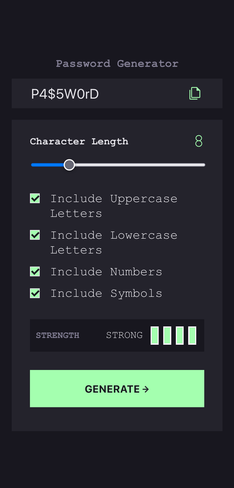
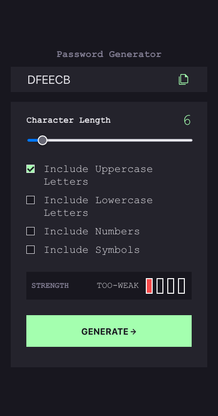

# Frontend Mentor - Password generator app

This is a solution to the [Password generator app challenge on Frontend Mentor](https://www.frontendmentor.io/challenges/password-generator-app-Mr8CLycqjh).

## Table of contents

- [Overview](#overview)
  - [The challenge](#the-challenge)
  - [Screenshot](#screenshot)
  - [Links](#links)
- [My process](#my-process)
  - [Built with](#built-with)
  - [What I learned](#what-i-learned)
  - [Continued development](#continued-development)
- [Author](#author)

## Overview

### The challenge

Users should be able to:

- Generate a password based on the selected inclusion options
- Copy the generated password to the computer's clipboard
- See a strength rating for their generated password
- View the optimal layout for the interface depending on their device's screen size
- See hover and focus states for all interactive elements on the page

### Screenshot

### Links

- Solution URL: [https://www.frontendmentor.io/solutions/password-generator-OSjAy7NPOV](https://www.frontendmentor.io/solutions/password-generator-OSjAy7NPOV)
- Live Site URL: [https://hidalest.github.io/password-generator/](https://hidalest.github.io/password-generator/)

## My process

### Built with

- Semantic HTML5 markup
- CSS custom properties
- Flexbox
- SCSS
- Mobile-first workflow
- [React](https://reactjs.org/) - JS library
- [Typescript](https://www.typescriptlang.org/) - JS library

### What I learned

This project was really challenging for me because I wanted to do it with TS without really knowing TS so I had to learn "on the fly" while doing the project.

I had to read a lot of stuff when facing an error about TS and, of course, most likely this project will not follow TS best practices but it helped me have an understanding and an idea about how TS is supposed to be used and how it works.

Also when finishing the project and realized that I overcomplicated things with the "password strength measure" component and I could just use regex and save some time.

### Continued development

Definitely need to learn more about TS, on this project I felt I didn't utilize the full power of this technology. For my next project and will be ready to use TS with stronger knowledge and best practices

## Author

- Frontend Mentor - [@hidalest](https://www.frontendmentor.io/profile/hidalest)
- Twitter - [@hidalest](https://www.twitter.com/hidalest)
